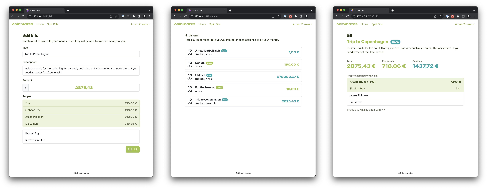

# coinmates

A service for bill splitting with friends. A small project to refresh React & Spring.



(click on the image to enlarge)

## Technologies

- Frontend:
  - React + React Router, React Hook Form, Zod
  - Bootstrap (without js)
  - Vite
  - TypeScript
- Backend:
  - Spring Framework + Web, Security, JPA, H2
  - Lombok, Mapstruct
  - Gradle
  - Java

## Limitations / TODO

- Not the best user experience at places at the moment
- Implement logout with cookie management (causes issues after backend restart)
- Write tests

## Running

You will need Java JDK 17 and npm. In `/frontend`, install the dependencies by running `npm install`. In `/backend`, do the same by running `./gradlew build`.

Then, in the respective directories, you can run the frontend with the command

```
npm run dev
```

and the backend with the command

```
./gradlew bootRun
```

The frontend is then available at `http://localhost:5173`.
